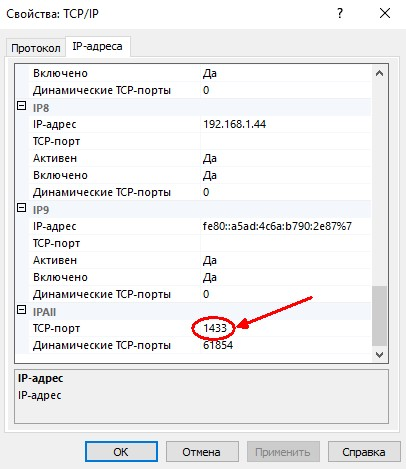

# TSN_JPA_HIBERNATE
Пример использования технологии JPA HIBERNATE в Java для NetBeans с MS SQL


Скрипты для создания таблиц:

```
USE master
GO
CREATE DATABASE tsn_demo
```

```
USE [tsn_demo]
GO

CREATE TABLE [dbo].[userrole](
	[id] [int] IDENTITY(1,1) NOT NULL,
	[name] [varchar](45) NULL,
	[accessCodes] [varchar](45) NULL,
 CONSTRAINT [PK_userrole] PRIMARY KEY CLUSTERED 
(
	[id] ASC
)WITH (PAD_INDEX = OFF, STATISTICS_NORECOMPUTE = OFF, IGNORE_DUP_KEY = OFF, ALLOW_ROW_LOCKS = ON, ALLOW_PAGE_LOCKS = ON) ON [PRIMARY]
) ON [PRIMARY]
GO
```

```
USE [tsn_demo]
GO

CREATE TABLE [dbo].[users](
	[id] [int] IDENTITY(1,1) NOT NULL,
	[userRoleID] [int] NULL,
	[login] [varchar](45) NULL,
	[password] [varchar](45) NULL,
	[description] [varchar](45) NULL,
	[note] [varchar](45) NULL,
	[availableDepartments] [varchar](45) NULL,
 CONSTRAINT [PK_users] PRIMARY KEY CLUSTERED 
(
	[id] ASC
)WITH (PAD_INDEX = OFF, STATISTICS_NORECOMPUTE = OFF, IGNORE_DUP_KEY = OFF, ALLOW_ROW_LOCKS = ON, ALLOW_PAGE_LOCKS = ON) ON [PRIMARY]
) ON [PRIMARY]
GO
```
**Это настройки, без которых ничего не заработает...)**





